# 🕵️‍♂️ Forecast — IP Threat Detection Flow

This document details the end-to-end technical flow of how an IP address (representing a network endpoint) is analyzed by the Forecast platform to detect anomalies and threats.

---

## 🏗️ Architectural Flow Diagram

```mermaid
sequenceDiagram
    participant Analyst as User / Analyst
    participant UI as React Dashboard
    participant API as FastAPI Backend (detection.py)
    participant ML as ML Engine (isolation_forest.py)
    participant DB as Supabase (PostgreSQL)
    
    Analyst->>UI: Enters IP / Flow Details
    UI->>API: POST /api/v1/detection/analyze (JSON Payload)
    API->>ML: load model & score_features(vector)
    
    rect rgb(20, 40, 60)
        Note over ML: Isolation Forest (scikit-learn / pure NumPy)<br/>1. Align & Scale features<br/>2. decision_function() -> Score<br/>3. predict() -> Anomaly Boolean
    end
    
    ML-->>API: Returns (Score, is_anomalous)
    API->>DB: Insert Anomaly Record (ORM)
    API->>DB: Insert Audit Log
    DB-->>API: Confirmation
    API-->>UI: Returns Anomaly Response JSON
    UI-->>Analyst: Displays Risk Score & Status Badge
```

---

## 🔄 Step-by-Step Process

### 1. User Input (The Frontend)
- **Action**: An analyst uses the Forecast React dashboard to manually submit a network flow for analysis, or the automated `network_engine` feeds packet metadata into the system.
- **Data Provided**: The core identifiers are `src_ip` (Source IP) and `dst_ip` (Destination IP), along with a `feature_vector` representing the statistical properties of the network traffic between those IPs.
- **Technology**: React, Vite, Axios.

### 2. API Ingestion (The Backend)
- **Action**: The frontend sends a `POST` request to the backend detection route.
- **Endpoint**: `/api/v1/detection/analyze` (located in `backend/app/api/routes/detection.py`).
- **Data Validation**: The FastAPI route uses a Pydantic schema (`AnomalyCreate`) to enforce strict typing and validation on the incoming JSON payload, ensuring the IP addresses are valid strings and the feature vector is a list of floats.
- **Security**: The route is protected by a dependency `Depends(require_roles("ADMIN", "DATA_SCIENTIST"))`, verifying the user's JWT session cookie.
- **Technology**: FastAPI, Pydantic, Python 3.13.

### 3. Machine Learning Inference (The ML Engine)
- **Action**: The API delegates the scoring to `DetectionService.detect_and_store()`.
- **Model Loading**: The service loads the pre-trained `AnomalyDetector` from disk (`ml_engine/saved_models/anomaly_model.pkl`).
- **Feature Alignment & Scaling**: 
  - The incoming `feature_vector` is aligned to match the exact feature names the model was trained on.
  - The vector is scaled using a Standard Scaler (subtracting the mean and dividing by the standard deviation).
- **Inference**:
  - The model calculates the `raw_score` using `model.decision_function()`.
  - It generates a boolean prediction using `model.predict()` (where `-1` indicates an anomaly, and `1` indicates normal traffic).
- **Data Used**: The specific network features evaluated typically include:
  - Total Packet Count
  - Total Byte Volume
  - Flow Duration
  - Source/Destination Port Entropy
  - Inter-arrival Times
- **Technology**: `scikit-learn` (specifically `IsolationForest`), `NumPy`, `joblib`. 
- *(Note: The ML engine includes a pure-NumPy fallback `_NumpyIsolationForest` to ensure the platform can run inference even in restricted environments where C-extensions are blocked).*

### 4. Persistence & Audit Logging (The Database)
- **Action**: Once the ML engine returns the anomaly score (e.g., `0.94`) and the boolean flag (`True`), the backend constructs an `Anomaly` SQLAlchemy ORM object.
- **Storage**: The anomaly record, including the IPs, ports, protocol, and ML scores, is written to the Supabase PostgreSQL database in the `anomalies` table.
- **Auditing**: An immutable audit log entry is written to the `audit_logs` table (e.g., `action="ANOMALY_ANALYSIS"`).
- **Technology**: SQLAlchemy 2.0 (asyncio), `asyncpg`, Supabase PostgreSQL.

### 5. Analyst Review (The Loop Closes)
- **Action**: The backend returns the newly created anomaly record to the frontend as JSON.
- **Display**: The React dashboard immediately updates, showing a red "Critical" badge if `is_anomalous` is True, along with the specific anomaly score. 
- **Next Steps**: The analyst can now choose to anchor this anomalous flow on the Ethereum blockchain as forensic evidence using the Evidence Vault.

---

## 🛠️ Summary of Technologies & Data
| Domain | Technology / Tool | Primary Data Handled |
| :--- | :--- | :--- |
| **Frontend** | React, Vite, Axios | IP strings, JSON API responses |
| **Backend API**| FastAPI, Pydantic, Uvicorn | Validated JSON, JWTs |
| **ML Engine** | scikit-learn (IsolationForest), NumPy | Float feature vectors |
| **Database** | Supabase, PostgreSQL, SQLAlchemy | Relational Anomaly & Audit records |
